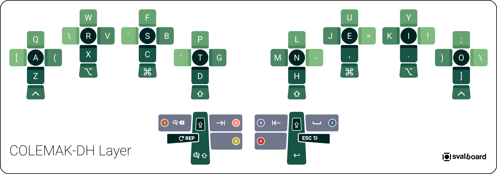
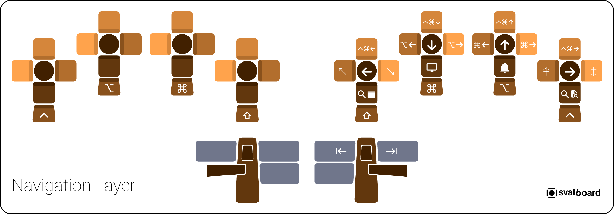
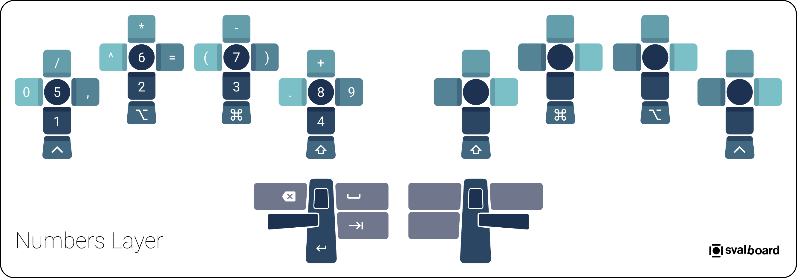
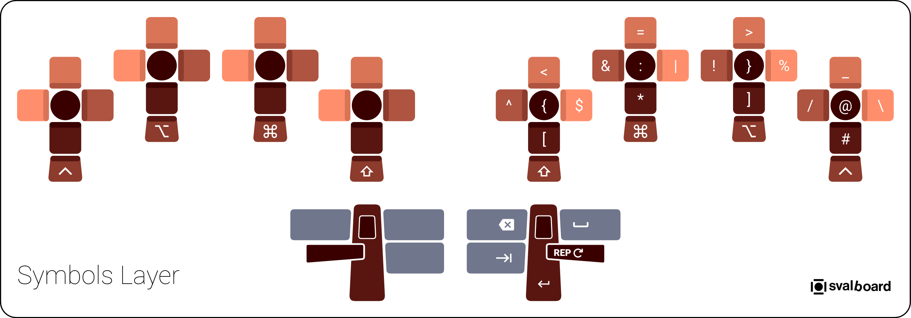
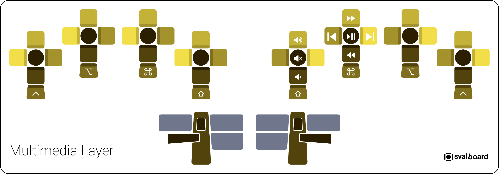
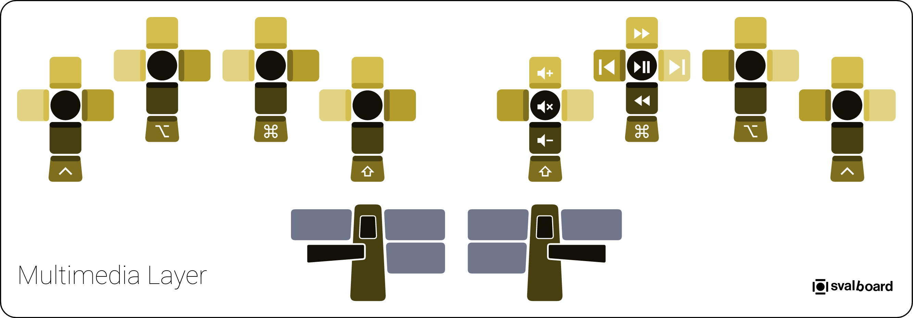
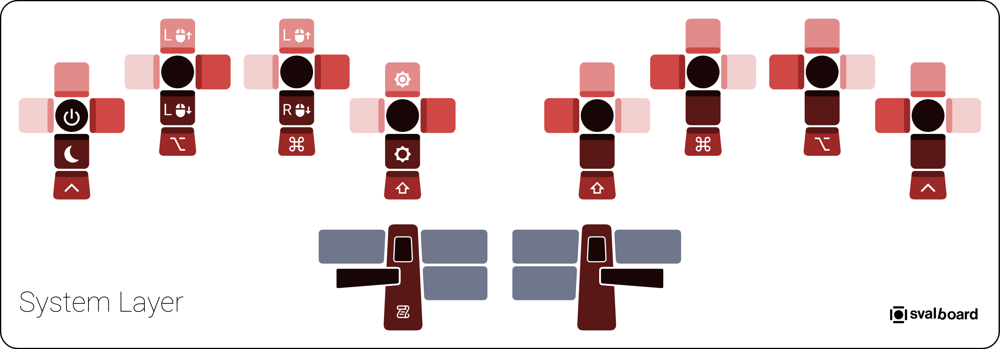

# Layer Reference

This document provides a complete visual reference for all keyboard layers in
the Svalboard COLEMAK-DH configuration.

## Layer Overview

| Layer | Name | Activation | Purpose |
| ----- | ---- | ---------- | ------- |
| 0 | BASE | Default | COLEMAK-DH letters with common symbols |
| 1 | NAV | Hold left thumb inward (Backspace) | Vim-style navigation and window management |
| 2 | NUM | Hold right thumb inward (Space) | Numeric keypad with operators |
| 3 | SYM | Hold left thumb outward (Tab) | Programming symbols and brackets |
| 4 | FUN | Hold right thumb outward (Back-tab) | Function keys F1-F20 |
| 5 | MED | Hold left thumb knuckle outward | Multimedia keys |
| 6 | SYS | Hold right thumb knuckle outward | System keys (keyboard firmware and OS) |
| 7 | MBO | Auto on trackball movement | Mouse buttons with modifiers |

## Svalboard Key Terminology

Understanding the Svalboard's unique key naming system:

### Finger Clusters

Each half has 4 finger clusters labeled `L1`-`L4` (left) and `R1`-`R4` (right),
numbered from inside to outside.

Keys are named by physical position:

- **C** (Center): Downward press
- **N** (North): Upward flick
- **E** (East): Right lateral movement
- **S** (South): Downward flick (scratching motion)
- **W** (West): Left lateral movement
- **DS** (Double-South): Behind South key, same activation

### Thumb Clusters

Thumb keys are named by the thumb part used:

- **Pad**: Inward thumb motion
- **Nail**: Outward thumb motion
- **Knuckle**: Outward thumb knuckle motion
- **Up**: Upward thumb motion
- **Down**: Downward thumb motion
- **DD** (Double-Down): Press Down key further after initial activation

---

## Layer 0: BASE

The primary typing layer with COLEMAK-DH letter arrangement and frequently used
symbols.

### Key Features

- **COLEMAK-DH letter layout** optimized for finger rolls
- **Home row modifiers** on Double-South keys (⌃ ⌥ ⌘ ⇧) accessible via downward
  flick
- **Dual-function thumb keys** for layer access (hold) and common keys (tap)

### Thumb Key Functions

- **Left Pad**: Backspace (tap) / `NAV` layer (hold)
- **Left Nail**: Tab (tap) / `SYM` layer (hold)
- **Left Down**: Shift (one-shot tap, hold, or Caps Word on double-tap)
- **Left Knuckle**: `MED` layer
- **Left Up**: Repeat last key
- **Left Double-Down**: Caps Word toggle
- **Right Pad**: Space (tap) / `NUM` layer (hold)
- **Right Nail**: Back-tab (⇧⇥) (tap) / `FUN` layer (hold)
- **Right Down**: Enter
- **Right Knuckle**: `SYS` layer
- **Right Up**: Escape
- **Right Double-Down**: Caps Word toggle

---

## Layer 1: NAV (Navigation)

Vim-style navigation and macOS window management on the right hand.

### Key Features

- **Vim-style arrows**: H(←) J(↓) K(↑) L(→) on right hand
- **Page navigation**: Page Up/Down, Home/End
- **Word/line navigation**: ⌥← / ⌥→ (word), ⌃← / ⌃→ (line)
- **macOS window management**: Mission Control, App Windows, Desktop switching

### Activation

Hold **Left Pad** (Backspace key) to activate.

---

## Layer 2: NUM (Numbers)

Numeric keypad layout with mathematical operators on the left hand.

### Key Features

- **Numbers 1-8** arranged bottom-to-top, outside-to-inside
- **Number 0** positioned on the _left side_ of `1`
- **Number 9** positioned on the _right side_ of `8`
- **Arithmetic operators** (+, -, *, /) on North keys
- **Parentheses** and **equals sign** for formula entry

### Activation

Hold **Right Pad** (Space key) to activate.

---

## Layer 3: SYM (Symbols)

Programming symbols and brackets on the right hand, organized for efficient chording.

### Key Features

- **Paired brackets**: {}, [], () positioned for easy chording
- **Comparison operators**: <, >, =
- **Logic symbols**: &, |, !
- **Special characters**: @, #, $, %, ^, *, /, \, _, :

### Activation

Hold **Left Nail** (Tab key) to activate.

---

## Layer 4: FUN (Function Keys)

All function keys `F1`-`F20` on the left hand.

### Key Features

- **F1-F9** follow the same convention as the numbers layer
- **F10** positioned where the number `0` is on the numbers layer
- **F11-F14** on North keys following the number increase pattern
- Arranged bottom-to-top, outside-to-inside for systematic access

### Activation

Hold **Right Nail** (Back-tab key) to activate.

---

## Layer 5: MED (Multimedia Keys)

Media playback and volume control on the right hand.

### Key Features

- **Volume control**: Volume Up/Down, Mute/Unmute
- **Playback control**: Play/Pause, Next/Previous track
- **Seek control**: Fast Forward, Rewind
- **Media keys** positioned on strong fingers for easy one-handed access

### Activation

Hold **Left Knuckle** to activate.

---

## Layer 6: SYS (System Keys)

System-level controls for display brightness, trackball DPI adjustment, and
power management on the left hand.

### Key Features

- **Display brightness**: Brightness Up/Down on `L1`
- **Trackball DPI control**: Independent DPI adjustment for both trackballs
  - Left trackball DPI: Up/Down on `L3`
  - Right trackball DPI: Up/Down on `L2`
- **Power control**: Power button on `L4` Center
- **Firmware mode**: Svalboard Output key for firmware state logging

### Activation

Hold **Right Knuckle** to activate.

---

## Layer 7: MBO (Mouse Buttons)

Auto-activated mouse layer with special mouse button keys and modifiers.

### Key Features

- **Special mouse button keys** on left Double-South positions (`MB_SFT`,
  `MB_ALT`, `MB_GUI`, `MB_CTL`)
- **Regular modifiers** on right Double-South for Cmd+Click, etc.
- **Sniper mode** on thumb Double-Down keys for precision pointing
- **Return to BASE** when pressing any key that is not a mouse button

### Activation

Automatically activated when you move either trackball.

### Special Mouse Button Keys (Left Double-South)

These keys have intelligent dual behavior:

- **MB_SFT**: Shift or mouse left click
- **MB_GUI**: Cmd or mouse middle click
- **MB_ALT**: Option or mouse right click
- **MB_CTL**: Control or mouse button 4 click

See [Advanced Features](advanced-features.md#special-mouse-button-keys) for
detailed behavior.

---

## Layout Philosophy

### Miryoku-Inspired Activation

Layers use a single-hand activation pattern: hold a layer key on one hand, and
all functional keys appear on the opposite hand. This eliminates same-hand
stretching and complex finger gymnastics.

Example: Hold left thumb Backspace → `NAV` layer keys appear on right hand only.

The modifiers keys are still available on the same key that activated the layer
so you can combine them with the active layer's keys.

### Key Organization Principles

- **Numbers/Functions**: Bottom-to-top (`1`→`9`, `F1`→`F9`), outside-to-inside
- **Symbols**: Paired logically for chording (`{}` and `[]` adjacent)
- **Navigation**: Vim-style HJKL with contextual modifiers
- **Modifiers**: Symmetrically placed on both hands for flexibility
- **Frequent keys**: Placed on strong fingers (index, middle)

---

## References

- [Miryoku Layout Philosophy](https://github.com/manna-harbour/miryoku)
- [COLEMAK-DH Layout](https://colemakmods.github.io/mod-dh/)
- [Svalboard Official Site](https://svalboard.com)
